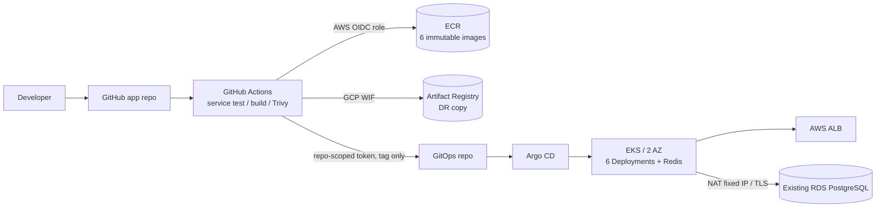

# Phase 1 Bank of Anthos — AWS EKS CI/CD + GCP DR Artifact

이 저장소는 인프라와 Kubernetes desired state를 소유합니다. 애플리케이션 소스와 CI는
`qkrwlgh335-lab/bank-of-anthos-app`에 분리합니다.

## 책임 경계

- GitHub Actions: 변경된 서비스를 검증하고 immutable artifact를 만들어 두 Registry에 저장.
- GitOps 저장소: 환경별 이미지 태그와 Kubernetes desired state의 Source of Truth.
- Argo CD: Git과 EKS 실제 상태의 차이를 지속적으로 reconcile.
- Terraform: VPC/EKS/ECR/IAM과 클러스터 add-on의 수명주기 관리.
- EKS: 실행 플랫폼. 여섯 서비스가 각각 Deployment/Service로 실행되며 EKS가 여섯 개인
  구조가 아닙니다.

AWS는 GitHub OIDC + IAM Role, GCP는 Workload Identity Federation을 사용합니다. 장기
Access Key/Service Account JSON은 GitHub에 저장하지 않습니다.

상세 설정은 [GitHub 설정](docs/github-setup.md)과 [실행 Runbook](docs/runbook.md)을 봅니다.
